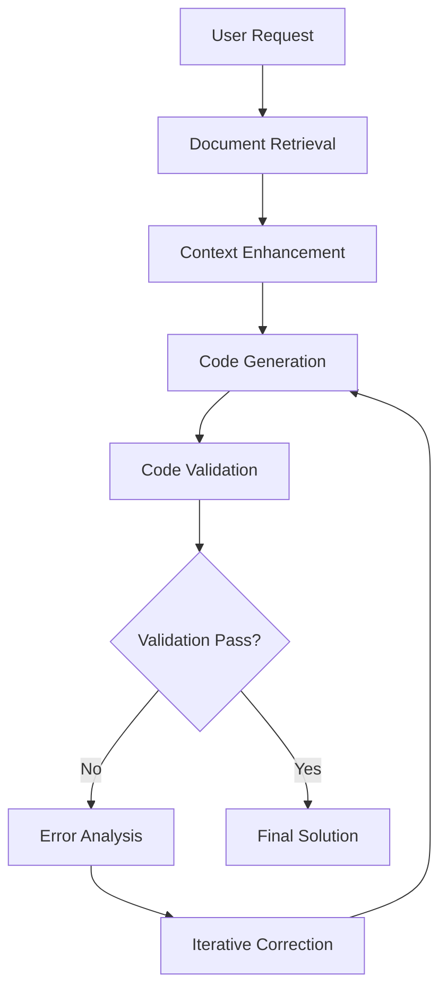

# 🤖 Advanced Code Assistant Agent

[](https://www.python.org/downloads/)
[](https://langchain.readthedocs.io/en/latest/modules/agents/tools/custom_tools.html)
[](https://developers.generativeai.google/)
[](LICENSE)

> **Enterprise-grade AI Code Assistant** with self-correcting workflows, RAG-powered documentation retrieval, and secure code execution environment.

## 🌟 Overview

An intelligent code assistant that combines **LangGraph workflow orchestration** with **RAG (Retrieval-Augmented Generation)** to provide context-aware code generation, analysis, and documentation. Built with production-ready architecture featuring self-correction capabilities and comprehensive validation.

### 🎯 Key Capabilities

- **🧠 Self-Correcting Workflows**: LangGraph-orchestrated iterative code improvement
- **📚 RAG-Powered Intelligence**: Context-aware generation using comprehensive documentation
- **🔒 Secure Execution**: Safe code validation and execution environment  
- **🌐 Multi-Domain Expertise**: Python, ML, data analysis, web scraping, and more
- **⚡ Real-time Adaptation**: Learns from errors and improves solutions automatically

## 🏗️ Architecture



### 🔧 Core Components

| Component | Purpose | Lines | Technology |
|-----------|---------|-------|------------|
| `main.py` | LangGraph workflow orchestrator | 318 | LangGraph, State Management |
| `code_generator.py` | Advanced code generation engine | 222 | Google Gemini, Pydantic |
| `document_loader.py` | RAG system with auto-discovery | 413 | FAISS, Embeddings |
| `validators.py` | Secure code execution & validation | 503 | AST, Sandboxing |

## 🚀 Features

### ✨ **Intelligent Code Generation**
- **Context-Aware**: Leverages 2.3MB knowledge base across 9 domains
- **Multi-Language**: Python, JavaScript, SQL, and more
- **Best Practices**: Follows PEP 8, includes error handling and documentation
- **Structured Output**: Type-safe responses with explanations and imports

### 🔄 **Self-Correcting Workflows**
- **Error Detection**: Automatic syntax and runtime error identification
- **Iterative Improvement**: Up to 3 correction cycles with learning
- **Dependency Management**: Smart package detection and suggestions
- **Validation Pipeline**: AST parsing, import checking, safe execution

### 📚 **RAG-Powered Knowledge**
- **Comprehensive Docs**: Python, ML, data analysis, web scraping, LangChain
- **Vector Search**: FAISS-based semantic document retrieval
- **Auto-Discovery**: Automatic documentation indexing and updates
- **Context Injection**: Relevant examples and patterns for each request

## 📦 Installation

### 🔧 Prerequisites
- **Python 3.10+** 
- **Google API Key** for Gemini models
- **Git** for repository management

### ⚡ Quick Start

```bash
# 1. Clone the repository
git clone https://github.com/bitphonix/ai-agents-hub.git
cd ai-agents-hub/advanced_agents/code_assistant

# 2. Create isolated environment
python -m venv code-assistant-env

# 3. Activate environment
# Windows:
code-assistant-env\Scripts\activate
# macOS/Linux:
source code-assistant-env/bin/activate

# 4. Install dependencies
pip install --upgrade pip
pip install -r requirements.txt

# 5. Configure environment
cp .env.example .env
# Edit .env and add: GOOGLE_API_KEY=your_api_key_here

# 6. Initialize knowledge base
python document_loader.py

# 7. Test the assistant
python main.py --interactive
```

### 🔒 Environment Configuration

Create `.env` file with your configuration:

```bash
# Required
GOOGLE_API_KEY=your_google_api_key_here

# Model Configuration
MODEL_NAME=gemini-1.5-flash
CODE_GENERATION_MODEL=gemini-1.5-pro

# Performance Settings
MAX_TOKENS=2000
TEMPERATURE=0.1
CHUNK_SIZE=600
```

## 💻 Usage

### 🎯 Command Line Interface

```bash
# Interactive mode - Best for exploration
python main.py --interactive

# Generate code from description
python main.py --generate "Create a REST API with FastAPI and authentication"

# Analyze existing code
python main.py --analyze my_script.py --language python

# Generate documentation
python main.py --document utils.py --output docs/
```

### 🐍 Python API

```python
from main import CodeAssistantAgent

# Initialize the agent
agent = CodeAssistantAgent()

# Generate code with context
result = agent.process_request(
    "Create a data visualization function that handles missing values"
)

# Access the generated solution
print("Generated Code:")
print(result.code_solution.code)
print(f"\nExplanation: {result.code_solution.explanation}")
print(f"Required packages: {result.code_solution.imports}")
```

### 📊 Example Outputs

<details>
<summary><b>🔍 Data Analysis Example</b></summary>

**Request**: *"Create a function to analyze CSV data and generate summary statistics"*

```python
import pandas as pd
import numpy as np
from typing import Dict, Any

def analyze_csv_data(file_path: str) -> Dict[str, Any]:
    """
    Analyze CSV data and generate comprehensive summary statistics.
    
    Args:
        file_path (str): Path to the CSV file
        
    Returns:
        Dict[str, Any]: Summary statistics and data insights
    """
    try:
        # Load data with error handling
        df = pd.read_csv(file_path)
        
        # Basic information
        analysis = {
            'shape': df.shape,
            'columns': df.columns.tolist(),
            'dtypes': df.dtypes.to_dict(),
            'missing_values': df.isnull().sum().to_dict(),
            'memory_usage': df.memory_usage(deep=True).sum()
        }
        
        # Numerical columns analysis
        numeric_cols = df.select_dtypes(include=[np.number]).columns
        if len(numeric_cols) > 0:
            analysis['numeric_summary'] = df[numeric_cols].describe().to_dict()
        
        return analysis
        
    except Exception as e:
        return {'error': f"Failed to analyze CSV: {str(e)}"}
```
</details>

<details>
<summary><b>🌐 Web Scraping Example</b></summary>

**Request**: *"Build a web scraper that extracts article titles and links"*

```python
import requests
from bs4 import BeautifulSoup
from typing import List, Dict
import time

def scrape_articles(url: str, max_articles: int = 10) -> List[Dict[str, str]]:
    """
    Scrape article titles and links from a webpage.
    
    Args:
        url (str): Target webpage URL
        max_articles (int): Maximum number of articles to extract
        
    Returns:
        List[Dict[str, str]]: List of articles with title and link
    """
    try:
        headers = {
            'User-Agent': 'Mozilla/5.0 (Windows NT 10.0; Win64; x64) AppleWebKit/537.36'
        }
        
        response = requests.get(url, headers=headers, timeout=10)
        response.raise_for_status()
        
        soup = BeautifulSoup(response.content, 'html.parser')
        articles = []
        
        # Common article selectors
        selectors = ['article h2 a', 'h3 a', '.post-title a', '.entry-title a']
        
        for selector in selectors:
            elements = soup.select(selector)[:max_articles]
            if elements:
                for element in elements:
                    articles.append({
                        'title': element.get_text(strip=True),
                        'link': element.get('href', ''),
                        'scraped_at': time.strftime('%Y-%m-%d %H:%M:%S')
                    })
                break
        
        return articles
        
    except Exception as e:
        return [{'error': f"Scraping failed: {str(e)}"}]
```
</details>

## 📁 Project Structure

```
code_assistant/
├── 🧠 Core Components
│   ├── main.py                 # LangGraph workflow orchestrator
│   ├── code_generator.py       # Advanced generation engine
│   ├── document_loader.py      # RAG system with auto-discovery
│   └── validators.py          # Secure execution environment
├── ⚙️ Configuration
│   ├── config.py              # Environment management
│   ├── .env.example           # Configuration template
│   └── requirements.txt       # Dependencies
├── 📚 Knowledge Base
│   ├── docs/                  # Documentation files
│   │   ├── python_basics.txt  # Python fundamentals
│   │   ├── ml_basics.txt      # Machine learning
│   │   ├── data_analysis.txt  # Data science
│   │   └── web_scraping.txt   # Web technologies
│   └── vector_store/          # Generated embeddings
│       ├── index.faiss        # Vector index (2.3MB)
│       └── index.pkl          # Metadata store
├── 🧪 Quality Assurance
│   ├── tests/                 # Unit tests
│   ├── verify_setup.py        # Setup verification
│   └── .gitignore            # Security exclusions
└── 📖 Documentation
    ├── README.md              # This file
    ├── SETUP.md               # Detailed setup guide
    └── docs/                  # Additional guides
```

## 🔧 Advanced Configuration

### 🎛️ Model Settings

```python
# config.py customization
MODEL_CONFIGURATIONS = {
    'development': {
        'model': 'gemini-1.5-flash',
        'temperature': 0.1,
        'max_tokens': 1000
    },
    'production': {
        'model': 'gemini-1.5-pro', 
        'temperature': 0.05,
        'max_tokens': 2000
    }
}
```

### 🗂️ Knowledge Base Extension

Add custom documentation to enhance the assistant's capabilities:

```bash
# Add your domain-specific docs
echo "Your custom documentation..." > docs/custom_domain.txt

# Rebuild vector store
python document_loader.py
```

### 🔒 Security Best Practices

- **API Keys**: Never commit `.env` files - use environment variables in production
- **Sandboxing**: Code execution is isolated but review generated code before production use
- **Rate Limiting**: Configure `REQUESTS_PER_MINUTE` to stay within API limits
- **Logging**: Monitor usage with `LOG_LEVEL=INFO` for debugging

## 🧪 Testing & Validation

### ✅ Automated Testing

```bash
# Run comprehensive setup verification
python verify_setup.py

# Run unit tests
python -m pytest tests/ -v

# Test specific components
python code_generator.py  # Test code generation
python validators.py      # Test validation system
```

### 📊 Performance Metrics

| Component | Performance | Memory Usage |
|-----------|-------------|--------------|
| Vector Store | 757 chunks | 2.3MB |
| Document Search | <100ms | Minimal |
| Code Generation | 2-5s | Model dependent |
| Validation | <500ms | Isolated process |

## 🤝 Contributing

We welcome contributions! Here's how to get started:

### 🛠️ Development Setup

1. **Fork the repository** and clone your fork
2. **Create a feature branch**: `git checkout -b feature/amazing-feature`
3. **Install dev dependencies**: `pip install -r requirements-dev.txt`
4. **Make your changes** with comprehensive tests
5. **Run the test suite**: `pytest tests/ --cov=.`
6. **Submit a pull request** with clear description

### 📋 Development Guidelines

- **Code Style**: Follow PEP 8, use Black formatter
- **Documentation**: Update docstrings and README for new features  
- **Testing**: Maintain >90% test coverage
- **Security**: Review code execution paths carefully
- **Performance**: Profile changes with large knowledge bases

### 🎯 Areas for Contribution

- **🔌 New Integrations**: Additional LLM providers (OpenAI, Anthropic, Local models)
- **🌐 Web Interface**: Streamlit/FastAPI frontend
- **📊 Analytics**: Usage metrics and performance monitoring
- **🔧 Tools**: IDE extensions (VS Code, PyCharm)
- **📚 Knowledge**: Domain-specific documentation

## 📈 Roadmap

### 🚀 Version 2.0 (Planned)
- [ ] **Multi-Model Support**: OpenAI, Anthropic, Local LLMs
- [ ] **Code Execution**: Jupyter kernel integration
- [ ] **Team Features**: Shared knowledge bases
- [ ] **API Server**: REST API for integration
- [ ] **Plugin System**: Extensible tool framework

### 🎯 Version 1.5 (Next)
- [ ] **Performance**: Caching and optimization
- [ ] **UI**: Web-based interface
- [ ] **Export**: Multiple output formats
- [ ] **Monitoring**: Usage analytics

## 📄 License

This project is part of the **AI Agents Hub** and is licensed under the MIT License. See the main repository for full license details.

## 🙏 Acknowledgments

- **LangChain & LangGraph**: Workflow orchestration framework
- **Google Gemini**: Advanced language models
- **FAISS**: Efficient vector similarity search
- **Contributors**: Thanks to all contributors and the open-source community

## 📞 Support

- **Documentation**: Check [SETUP.md](SETUP.md) for detailed guides
- **Issues**: Report bugs via GitHub Issues
- **Discussions**: Join conversations in GitHub Discussions
- **Community**: Share your creations and get help

---

<div align="center">

**Built with ❤️ by the AI Agents Hub community**

[⭐ Star this repo](https://github.com/bitphonix/ai-agents-hub) | [🐛 Report Issues](https://github.com/bitphonix/ai-agents-hub/issues) | [💡 Request Features](https://github.com/bitphonix/ai-agents-hub/issues/new)

</div>
